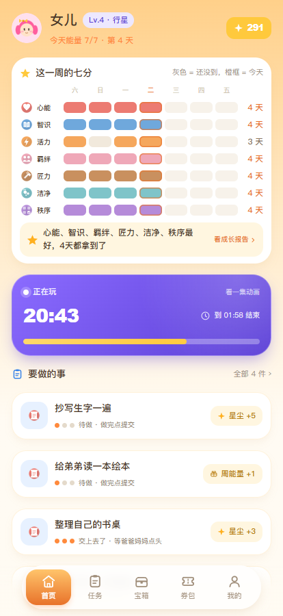
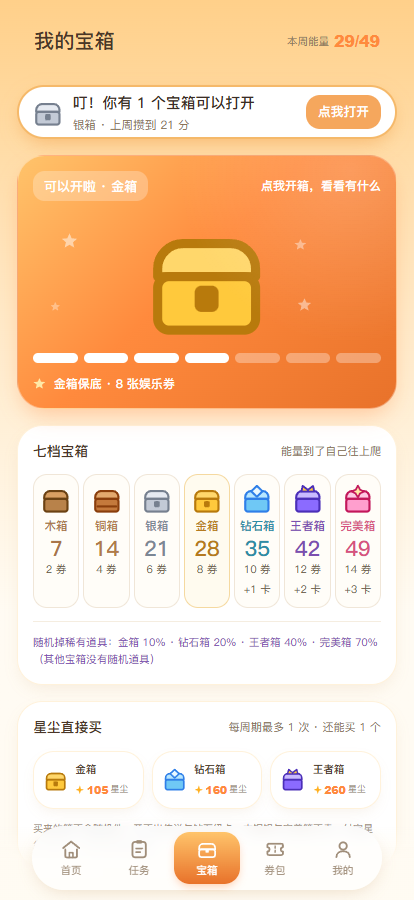

# 家庭积分 FamilyPoints

自建的家庭积分系统，跑在自己家的 NAS 上。孩子每天七个维度各 1 分，攒周能量开宝箱，攒星尘换消费额度、娱乐时间和特权券。四个家人各有自己的界面：孩子端只看得见自己的分和手上的活，家长端只做裁判。

Python 3 标准库 + SQLite，没有第三方依赖，不用 `pip install`，一个 Docker 容器装完。手机浏览器打开就能用，桌面宽屏会自动排成两列三列。

## 界面

| 孩子端 · 首页 | 孩子端 · 我的宝箱 | 家长端 · 总览 | 家长端 · 打分 |
|:---:|:---:|:---:|:---:|
|  |  |  |  |

登录是头像墙，点自己的头像再输四位数字。剩下的截图（任务大厅、券包、图鉴、成长报告、我的、登录页，以及家长端的审核、发布、我的）在 [`screenshots/`](screenshots/) 里。

## 孩子端

底栏五格：首页、任务、宝箱、券包、我的。

- **首页**是一张七分矩阵，七个维度横着走，这一周七天竖着走。拿到的那格填上它自己的颜色，今天套一圈橙框。底下两句是这一周现算的结论，右边挂着进成长报告的入口。有娱乐券在用的话，最上面是一条倒计时，写清到几点结束。心愿那一行上面是「遇到困难」，卡住了说一声就行。二级页从哪一屏进去的就退回哪一屏。
- **任务**分两块。大厅里是家长挂出来的活，孩子自己接；「我手上」是接了的和交了等确认的，两种都列出来，不会交了就不见。再往下一块是「任务记录」，最近三条直接摆在页面上，做完的、被退回的、自己放下的都在，想看全部点一下展开半屏，最多回溯近一个月。
- **宝箱**七档，门槛 7 / 14 / 21 / 28 / 35 / 42 / 49 分。达标了就能开，也可以直接花星尘买。箱子发下来先躺着，孩子自己点开才抽内容，里面是什么开的那一刻才定。
- **券包**分「我的券」和「券商店」两个页签。券有六种：娱乐券（30 分钟一张）、陪伴券、选择券、豁免券、好友券、独处券。正在玩的时候顶上报剩余时间，下面一条写「今天还能玩多少」。娱乐券按「轮」算，白天一轮 3 张、晚间 2 张，一轮用完要歇 60 分钟，到点自动结束。清单正上方挂着「想多玩一会儿」，点一下就是申请加时，不用攒卡也不用先表现好。
- **我的**是等级和升级进度、星尘余额、特权道具、这个月的完美日，往下依次是心愿屋、图鉴（收了多少张卡）、成长报告、家庭、头像。

## 家长端

底栏五格：总览、审核、打分、发布、我的。

- **总览**一眼看完今晚要办的事，几张卡分别是待打分和待审核的件数，下面是两个孩子今天的进度和最新发生的十二条。
- **审核**是孩子交上来的活、券申请、心愿、加时、零花钱、求助。凡是要动账的动作，点下去先弹一层确认，弹层里写清点了会发生什么。
- **打分**是四个孩子 × 七个维度，每天四种状态：还没打、可以补、已经打了、过期锁死。没打的日子点一项记一项，不用按保存。
- **发布**顶部三格：写任务（能选挂大厅还是派给哪个孩子，派给谁是一排按钮；还能给任务配图，配图走游戏任务那一套）、写校准（后果怎么落地，按选的处理方式自己定档）、我发出的 N。
- **我的**分四块：身份卡；我的（我的记录、家人账号、改我的密码）；家里的事（家庭页、宝箱与券、商店与汇率、心愿与许愿池、设置）；最下面单独一行备份与导出。设置是独立一页，分两级：先按七组列，点进去才看见这一组的项。「通知与推送」「假期日历」也收在设置里对应的那一组。版本号和项目地址在「我的」页脚。

## 跑起来

```bash
cd app
docker compose up -d --build
```

打开 `http://<NAS 的地址>:3637`，第一次进去会让你设家长账号。数据存在 `app/data/`，整个目录拷走就是完整备份。

不想用 Docker 就直接跑：

```bash
cd app
python server.py          # 需要 Python 3.11+，没有别的依赖
```

端口、首次设置、备份、排错写在 [app/部署到NAS.md](app/部署到NAS.md) 里。

## 所有数字都在库里

积分门槛、宝箱七档、券的价格和限购、娱乐券时长、硬停止时间、月兑换上限、星尘汇率，没有一个是写死在代码里的。设置页里能改的都能改，改完不用重新部署。

## 目录

```
app/            服务本体：后端、前端、测试、工具
  server.py     入口，http.server
  db.py         建库与迁移链
  engine.py     规则引擎，分数、宝箱、券、结算都在这
  api/          按域拆的接口
  web/          原生 JS + CSS，孩子端与家长端两套皮一份代码
  tools/        图标生成、打包、端到端巡检
  smoke_test.py 引擎层测试
  api_test.py   接口层测试
docs/           规则真值与响应式方案
screenshots/    界面截图
```

## 规则真值在哪

`docs/项目当前开发文档.md` 是唯一的规则真值，每一条都标了落在代码的哪个文件哪一行。改代码之前先看它，改完代码要回头核对行号。

技术实现、为什么要这么写、本地怎么跑测试，看 [app/README.md](app/README.md)。

## 技术选择

- **零依赖**：目标是长辈家里那台 NAS，装得上就永远跑得起来。没有 npm、没有 pip、没有构建步骤，改一行前端刷一下就见效。
- **SQLite 单文件**：四个人用，并发压力约等于零。余额不做冗余字段，一律由流水求和，对不上账时能一行行查回去。
- **服务端渲染的不是页面，是数据**：前端是一份原生 JS，两套皮（`body.kid` / `body.grown`）共用同一份逻辑，改规则只用改一处。
- **规则会变，所以规则不进代码**：孩子会长大，家长的想法也会变，能调的都进设置表。

## 已知边界

- 推送只覆盖 iOS 的 Bark，发送失败没有告警。
- 家长忘记密码只能停机改库，没有邮箱找回。
- 日志只增不改不删。
- 图标和头像不开放上传，换图要重新生成资源。

前三条在代码注释和文档里都写着，属于已知取舍，不是没做完。

## 许可

仓库公开，但不是开源。这里没有许可文件，未授予使用、复制、修改或再分发的权利。
